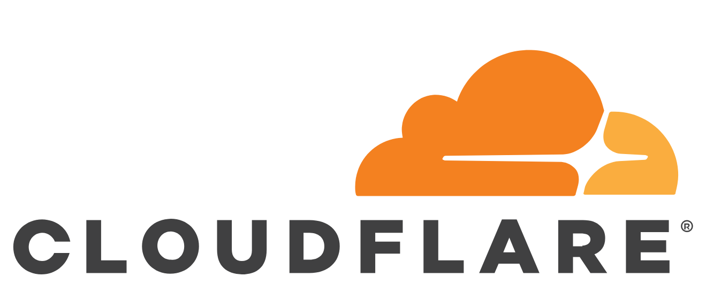

Guzzle Cloudflare Bypass
========================

[](http://github.com/jaymoulin/guzzlehttp-cloudflare/releases)

[](https://www.paypal.me/jaymoulin)
[](https://www.buymeacoffee.com/3Yu8ajd7W)
[](https://patreon.com/jaymoulin)

(This product is available under a free and permissive license, but needs financial support to sustain its continued improvements. In addition to maintenance and stability there are many desirable features yet to be added.)

Bypass Cloudflare DDoS protection - Please use it carefully

This package is based on [KyranRana's cloudflare-bypass](https://github.com/KyranRana/cloudflare-bypass).

Installation
------------
Using `composer`

```bash 
composer require jaymoulin/guzzlehttp-cloudflare
```

Usage
-----

```php
$sUrl = 'https://thebot.net/';
$oClient = new \GuzzleHttp\Client([
    'cookies' => new \GuzzleHttp\Cookie\FileCookieJar(tempnam('/tmp', __CLASS__)),
    'headers' => ['Referer' => $sUrl],
]); // 1. Create Guzzle instance
$aOptions = [
    'cache' => new \CloudflareBypass\Storage($sPathToYourCacheFolder),
]; // Example for cache, this is completely optional, with $sPathToYourCacheFolder a string to your cache folder
/** @var \GuzzleHttp\HandlerStack $oHandler */
$oHandler = $oClient->getConfig('handler');
$oHandler->push(\GuzzleCloudflare\Middleware::create($aOptions)); //2. ???

echo (string)$oClient->request('GET', $sUrl)->getBody(); //3. Profit!!
```
